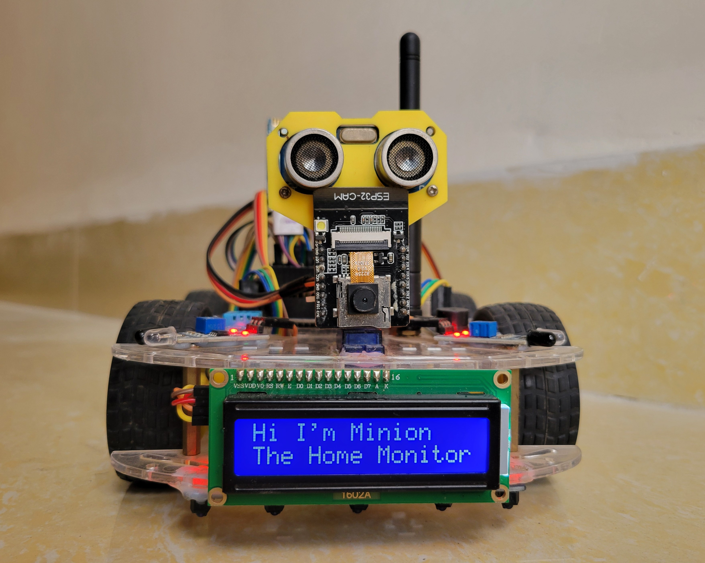
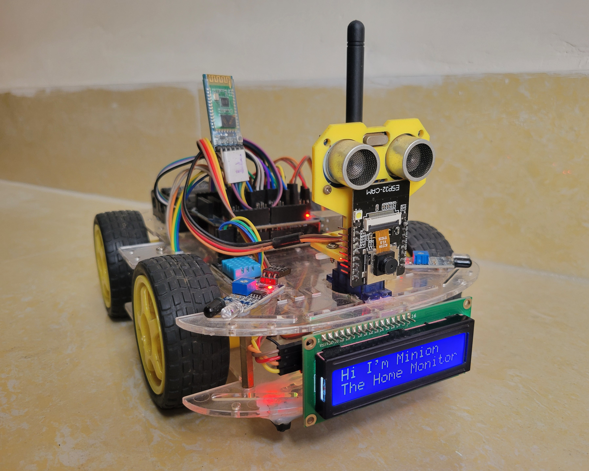
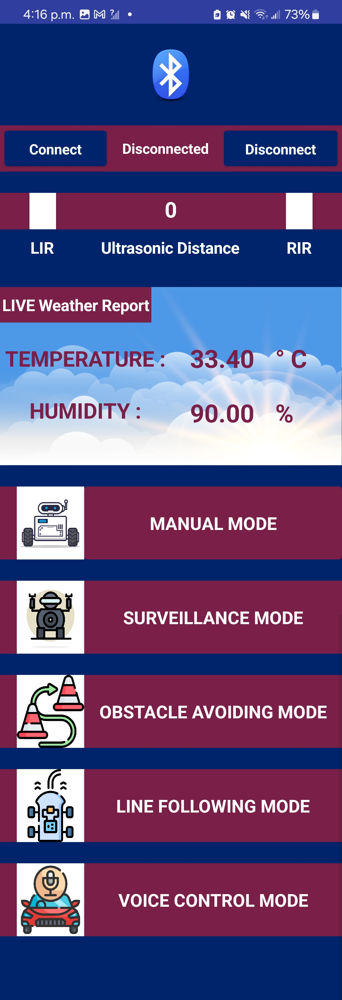
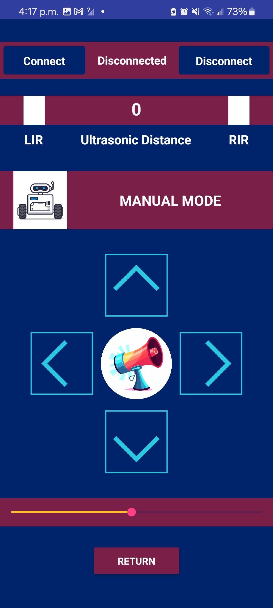
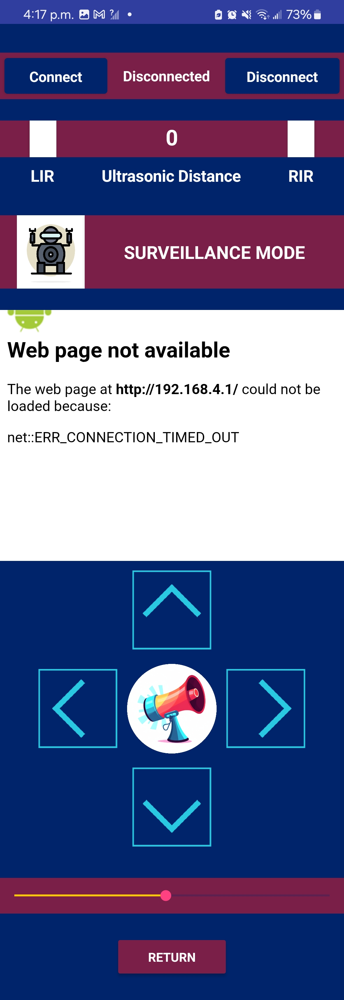
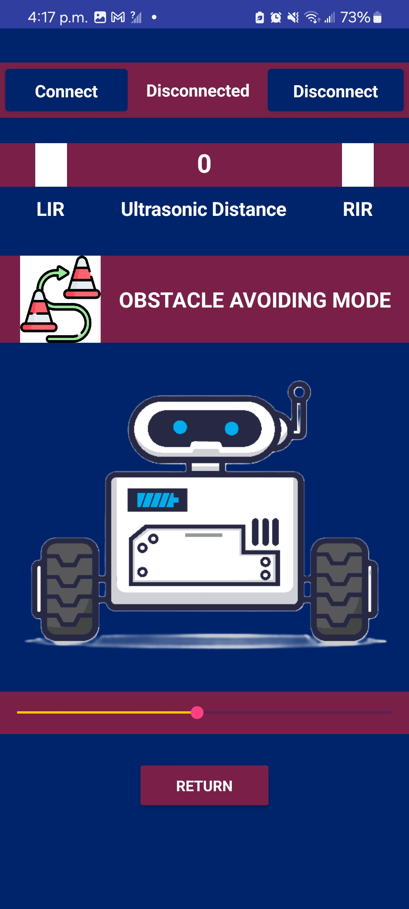
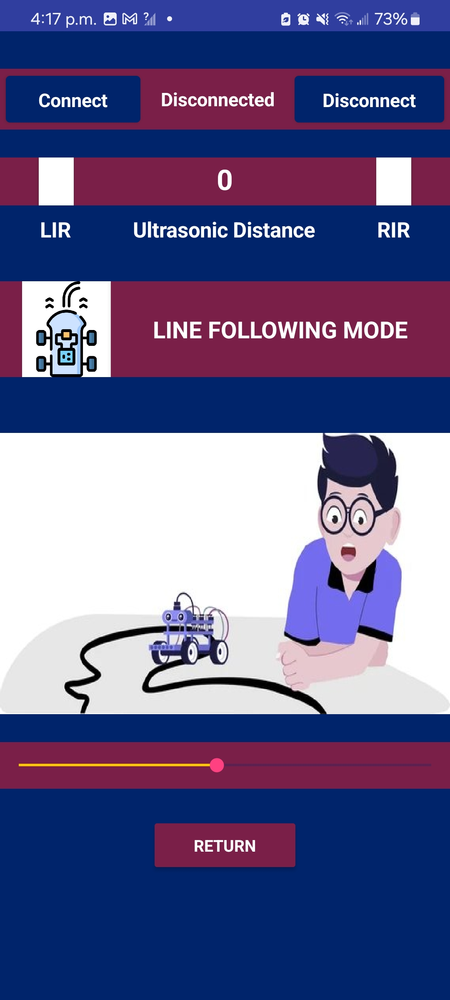
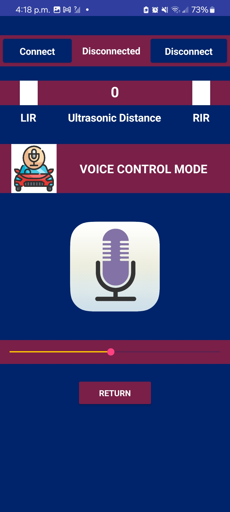

# 🤖 Android-Controlled Multifunctional Arduino Robot Car

  
  

This is a **Bluetooth-controlled Multifunctional Robot Car** built using **Arduino Uno** and an **Android App**. It supports five intelligent modes like manual control, obstacle avoidance, line following, surveillance, and voice command. A perfect blend of embedded systems, automation, and mobile app control.

---

## 📱 Android Application

Developed using **MIT App Inventor**, the custom Android app gives you full control over the robot with real-time feedback.

### 🔑 Features:
- 🌡️ **Live Weather Report** using onboard **DHT11 Sensor**
- 📊 **Sensor Dashboard**:
  - Left IR & Right IR sensor status (color-coded)
  - Real-time ultrasonic distance display
- 🎮 Select and control various robot modes
- 📹 Real-time **ESP32-CAM** video stream in Surveillance Mode

  

👉 **[Download the Android App](App/RoboCar.apk)**

---

## 🚀 Robot Features

Each mode provides a unique functionality powered by onboard sensors and modules.

### 🕹️ 1. Manual Mode  
- Control movement: forward, backward, left, right  
- Adjustable speed control  
- Horn functionality  

  

---

### 🛰️ 2. Surveillance Mode  
- All features of Manual Mode  
- Real-time video streaming using **ESP32-CAM**  

  

---

### 🚧 3. Obstacle Avoidance Mode  
- Autonomous obstacle detection using **Ultrasonic Sensor**  
- Servo-based distance scanning and auto navigation  

  

---

### ➿ 4. Line Following Mode  
- Track black line on white surface using **5-array tracker sensor**  
- Smooth curve following and auto-correction  

  

---

### 🎙️ 5. Voice Control Mode  
- Voice commands like “forward”, “stop”, “right”, etc.  
- Controlled using Google Speech Recognition from the Android app  

  

---

---

# ⚙️ Getting Started

### To build the **Multifunctional Bluetooth Controlled Arduino Robot Car**, follow these steps.

---

## 🧩 Required Components

| Component | Description |
|----------|-------------|
| 1. | 4 Wheel Car Chassis / Custom Chassis |
| 2. | L298n Motor Driver |
| 3. | Arduino Uno |
| 4. | Arduino Sensor Shield V5.0 |
| 5. | HC-05 Bluetooth Module |
| 6. | IR Sensors (x2) |
| 7. | SC-SR04 Ultrasonic Sensor |
| 8. | 5-Array Line Tracker Sensor |
| 9. | DHT11 Temperature & Humidity Sensor |
| 10. | SG90 Servo Motor |
| 11. | Buzzer Module |
| 12. | ESP32-CAM Module |
| 13. | Battery Holder + 18650 3.7V Batteries |
| 14. | Connecting Wires |
| 15. | Power Switch |
| 16. | Soldering Gun & Glue Gun |
| 17. | Android Phone |  

---

## 📂 Circuit Connections

All hardware connections (Arduino, sensors, motor driver, Bluetooth, etc.) are documented in the following file:

📥 **[Circuit_Connections.pdf](Circuits%20and%20Semantics/Circuit%20Connections.pdf)**

This includes:

- Motor wiring with L298N  
- Power setup  
- Sensor connection pins  
- Communication modules like HC-05 and ESP32-CAM  

---

## 🔧 Uploading Code (Arduino Uno & ESP32-CAM)

### 📥 1. Upload Code to Arduino Uno

1. Connect the **Arduino Uno** to your computer via USB.  
2. Open the **Arduino IDE**.  
3. Navigate to **File > Open** and load the main Arduino `.ino` file from the `/Arduino_Code/` directory.  
4. Set the following in **Tools** menu:
   - **Board:** Arduino Uno  
   - **Port:** Select the correct COM port  
5. Click the **Upload** button.

✅ Your Arduino is now programmed with the logic to handle all 5 operational modes.

### 📥 2. Upload Code to ESP32-CAM

> Used for **Realtime Video Streaming** in Surveillance Mode.

1. Connect the **ESP32-CAM** module to your PC using a USB-to-Serial converter (like FTDI).  
2. Make sure **IO0 is connected to GND** while uploading.  
3. Open the ESP32-CAM code in **Arduino IDE** from `/ESP32_Code/`.  
4. Select the following preferences under **Tools**:

   - **Board:** `AI Thinker ESP32-CAM`  
   - **Flash Frequency:** `80 MHz`  
   - **Flash Mode:** `QIO`  
   - **Partition Scheme:** `Huge APP (3MB No OTA/1MB SPIFFS)`  
   - **Upload Speed:** `115200`  
   - **Port:** Select the correct port (from your USB-to-Serial module)

5. Click the **Upload** button.  
6. Once uploading is complete, **disconnect IO0 from GND** and press the **RESET** button on ESP32-CAM.

✅ Now your ESP32-CAM is ready to stream video live to the Android app.

---

## 📱 Connect with Android App
- Install the custom-built app:
[**📥 Download RoboCar.apk**](App/RoboCar.apk)

- Turn on Bluetooth on your phone and pair with the HC-05 module (default password: 1234 or 0000).
- Open the app and tap Connect to select the HC-05 device.
- Explore the 5 Modes:
    1. Manual
    2. Surveillance (with ESP32 video stream)
    3. Obstacle Avoidance
    4. Line Following
    5. Voice Control

📸 Realtime data and UI will reflect IR, ultrasonic, and temperature sensor feedback.

## 🧑‍💻 Credits & Contact
This project was fully designed, integrated, and developed by:

**🎓 Niloy Sannyal**

- 📧 Email: [niloysannyal@gmail.com](mailto:niloysannyal@gmail.com)  
- 📍 Location: Dhaka, Bangladesh  
- 📱 Mobile: +8801783445245 

📌 Feel free to reach out for collaborations, improvements, or queries.

